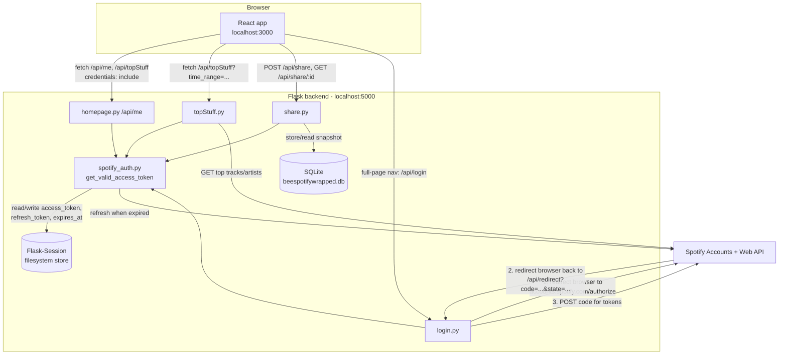

# BeeSpotifyWrapped — Study Notes

A running technical reference for this project: what was built, why it was built that way,
what alternatives were considered and rejected, and every bug that was found and fixed along
the way — including the ones that existed before this rebuild. Written to be read later, by
yourself, without me in the room. This file grows as the project grows.

---

## 1. What this project is

BeeSpotifyWrapped is a clone of Spotify's yearly "Wrapped" feature, with three differences from
the real thing:

1. **You choose the timeframe.** Spotify's own Wrapped only shows you one fixed year. This app
   lets you pick "Last 4 Weeks", "Last 6 Months", or "All Time" (these map directly onto
   Spotify's own `time_range` API parameter — see §7).
2. **You stay logged in.** Spotify's Web API uses OAuth access tokens that expire after one
   hour. Most simple integrations make you log in again every hour. This app refreshes your
   token silently in the background so you never see a login screen again after the first time
   (see §5).
3. **You can share it.** A "Share this Wrapped" button generates a public link that shows a
   read-only version of your stats — no login required to view it (see §11).

Stack: **Flask** (Python) backend talking to the real Spotify Web API, **React** frontend,
**SQLite** for the one piece of data that needs to outlive a session (shared snapshots).

---

## 2. Where the project actually started

Before this session, the repo already had a real skeleton, not a blank slate. It's worth
recording what existed and what was wrong with it, because several of the "decisions" below are
really "bugs found while reading the existing code," not choices made from scratch.

**What was already there:**
- `backend/controllers/login.py` — built the Spotify authorize URL and exchanged the returned
  `code` for an access token.
- `backend/controllers/homepage.py`, `topStuff.py`, `logout.py` — fetched the logged-in user's
  profile and top tracks/artists.
- A Create React App frontend, but never built on — `App.js` was still importing a component
  (`UserInfoPage`) that didn't exist anywhere in the repo, and an `axios` import even though
  `axios` was never added to `package.json`. This file could not have run.

**Real bugs found in the existing backend code:**

| Bug | Where | Why it mattered |
|---|---|---|
| Client secret hardcoded as a literal base64 string in the source | `login.py` | Anyone reading the code (or the git history) gets the Spotify app secret, even though `.env` correctly held the real value and was gitignored — the hardcoded copy defeated that entirely |
| `app.secret_key = os.urandom(24)` | `app.py` | Regenerates a new random key every time the server restarts. Flask signs session cookies with this key — a new key makes every previously-issued cookie fail signature verification, silently logging out every user on every restart |
| No `refresh_token` ever stored | `login.py` | Spotify's token exchange returns a `refresh_token` alongside the `access_token`, but the code only kept `access_token`. Without it, there is no way to get a new access token once the 1-hour one expires except making the user log in again — which directly contradicted the "don't make me log in every time" requirement |
| `top_tracks` / `top_artists` referenced before being guaranteed to exist | `topStuff.py` | The code only assigned `top_tracks = response.json()` inside the `if response.status_code == 200:` branch, but *used* `top_tracks` outside that `if`. Any failed Spotify API call (expired token, rate limit, network blip) would crash with `NameError` instead of a handled error |
| `time_range` hardcoded to `'long_term'` | `topStuff.py` | No way to ask for a different timeframe — this was the entire point of the "better than real Wrapped" requirement |
| Auth-check routes returned `redirect(url_for('login.login'))` | `homepage.py`, `topStuff.py` | This makes sense for a server-rendered app, but this is a React single-page app calling these routes with `fetch()`. A `fetch()` call doesn't meaningfully "follow" a redirect into Spotify's own login page — see §8 for why this needed to become a plain JSON 401 instead |
| `SPOTIFY_REDIRECT_URI` in `.env` pointed at `/getToken`, but the actual Flask route was `/api/redirect` | `.env` vs `login.py` | These two have to match *exactly* (and also match what's registered in the Spotify Developer Dashboard) or Spotify's redirect lands on a 404 |
| `requirements.txt` contained only `flask` | `backend/requirements.txt` | Missing `flask-cors`, `python-dotenv`, `requests` — all of which the existing code already imported and depended on. A fresh clone of this repo could not have run `pip install -r requirements.txt` and had a working app |

None of this is unusual for a project built a piece at a time while learning — it's exactly the
kind of thing a code review at this stage should catch. Recording it here so the *reasons* for
each fix are traceable later.

---

## 3. Architecture, end to end



The important thing this diagram is meant to make obvious: **every protected route goes through
`spotify_auth.get_valid_access_token()` before it touches Spotify.** That single choke point is
what makes automatic refresh possible without repeating the expiry-check logic in every route —
see §5 and §9.

---

## 4. Concept: the OAuth 2.0 Authorization Code flow

This app uses what Spotify calls the **Authorization Code Flow** — the standard flow for a
server that has a backend capable of keeping a secret (the `SPOTIFY_CLIENT_SECRET`). It's worth
naming the actors and steps once, precisely, because "OAuth" gets used loosely:

1. **Your Flask app** redirects the user's browser to Spotify's own login/consent page
   (`accounts.spotify.com/authorize`), passing your app's `client_id`, the permissions you're
   asking for (`scope`), and a `redirect_uri` — where Spotify should send the browser back to
   afterward. (`login.py`, `login()`)
2. **The user** logs into Spotify (if not already) and approves (or denies) the permissions.
   Your app never sees their Spotify password — that's the whole point.
3. **Spotify** redirects the browser back to your `redirect_uri`, with a short-lived,
   single-use `code` in the query string (and the `state` value you sent, unchanged).
4. **Your Flask app** takes that `code` and makes a *separate, server-to-server* POST request to
   `accounts.spotify.com/api/token`, authenticating itself with `client_id` + `client_secret`
   (never exposed to the browser), and exchanges the `code` for an `access_token` **and a
   `refresh_token`**. (`login.py`, `redirectPage()`)
5. From then on, the `access_token` is sent as a `Bearer` token on every Spotify Web API call
   (`Authorization: Bearer <token>`), until it expires in ~1 hour.

**Why the `state` parameter exists:** `login()` generates a random string and stores it in the
session before redirecting to Spotify, then `redirectPage()` checks that the `state` Spotify
sent back matches. This defends against a **CSRF-style attack**: without it, an attacker could
craft their own authorization redirect and trick a victim's browser into completing a login flow
that isn't the victim's, potentially binding the attacker's Spotify account to the victim's
session. Matching `state` guarantees the callback we're processing is the one *we* initiated.

**Why the access token needs refreshing at all:** Spotify deliberately issues short-lived access
tokens (~1 hour) so that if one leaks, the exposure window is small. The `refresh_token`, by
contrast, is long-lived and is what makes "stay logged in" possible — see §5.

(Not used here, but worth knowing exists: **PKCE**, an extension of this same flow designed for
clients that *can't* keep a secret — mobile apps, single-page apps with no backend. Since this
app has a real backend holding `SPOTIFY_CLIENT_SECRET`, the plain Authorization Code flow is the
correct, simpler choice.)

---

## 5. Concept + decision: sessions, cookies, and why the session storage changed

### What a Flask session actually is by default

Out of the box, `flask.session` is **not** stored on the server at all. It's a dictionary that
Flask serializes, **cryptographically signs** (using `app.secret_key` and a library called
`itsdangerous`), and sends to the browser as the *entire* cookie value. The signature stops a
client from *tampering* with it undetected, but — and this is the part that's easy to miss —
**signing is not encryption**. The payload is base64-encoded, not encrypted, so anyone who can
read the cookie (browser devtools, a proxy, a browser extension) can decode and read its
contents, they just can't forge a *new* one without the secret key.

That distinction is why storing `access_token` and `refresh_token` directly in a default Flask
session is a bad idea for this app: those values would sit in the user's browser, readable, for
as long as the cookie lives.

### The fix: `Flask-Session` with a filesystem backend

`app.py` now does:

```python
app.config["SESSION_TYPE"] = "filesystem"
app.config["SESSION_FILE_DIR"] = os.path.join(os.path.dirname(__file__), "flask_session")
app.config["SESSION_PERMANENT"] = True
Session(app)
```

With `Flask-Session` installed and configured this way, `flask.session` still *looks* identical
in the code (`session['access_token'] = ...`), but the actual dictionary is now pickled to a file
under `backend/flask_session/`, and the cookie the browser holds contains **only an opaque
session ID** pointing at that file. The tokens themselves never leave the server. This is the
standard trade-off: client-side sessions scale better (any server can read them, no shared
storage needed) but can't hold secrets; server-side sessions can hold secrets but need shared
storage once you have more than one server process (a problem for a future "multiple instances"
milestone, not this one — a single Flask dev process is fine with a local filesystem store).

### Why `app.secret_key` had to come from `.env`

Flask-Session still uses `app.secret_key` to sign the session-*ID* cookie (proving the ID wasn't
tampered with), even though the session data itself is no longer in the cookie. The old
`os.urandom(24)` generated a fresh key on every process start, which meant every previously
issued session-ID cookie stopped verifying the instant the server restarted — effectively
logging out every user, every restart. Moving it to `FLASK_SECRET_KEY` in `.env` (generated once,
reused across restarts) is what makes "sessions survive a server restart" true.

### Why sessions are `permanent`

By default, a Flask session cookie has no explicit expiry — it's a "session cookie" in the
browser sense, which most browsers delete when the browser itself closes. `session.permanent =
True` (set in `spotify_auth.store_token_response()`) switches it to use
`app.config["PERMANENT_SESSION_LIFETIME"]` instead — set here to 30 days. That's the piece that
answers "will I still be logged in tomorrow, after closing my laptop" — yes, for 30 days, because
the cookie itself now carries an explicit 30-day expiry rather than dying with the browser
session.

---

## 6. A pitfall that looks like a CORS bug but isn't: cookie host-matching

While wiring the frontend and backend together, there's a failure mode that's easy to misdiagnose
as a CORS problem because the symptom looks identical (*"the frontend calls the API but the
server acts like I'm not logged in"*), but the actual cause is a **cookie scoping rule**, not
CORS at all. It's worth separating the two clearly, because they're commonly conflated.

The original `.env` had:
```
SPOTIFY_REDIRECT_URI=http://127.0.0.1:5000/getToken
```

Walk through what happens if the backend runs on `127.0.0.1:5000` and the React dev server on
`localhost:3000`:

1. Spotify redirects the browser to `http://127.0.0.1:5000/api/redirect`. Flask sets the session
   cookie here. Cookies are scoped by **hostname**, and — critically — **`127.0.0.1` and
   `localhost` are different hostnames** as far as a browser's cookie jar is concerned, even
   though they resolve to the same machine. The cookie gets stored under the host `127.0.0.1`.
2. The React app, running at `localhost:3000`, later calls `fetch('/api/me')`. Because the
   cookie was scoped to `127.0.0.1`, it is **never attached** to a request whose page origin is
   `localhost`. The request goes out with no session cookie at all.
3. Flask correctly returns `401 not_authenticated` — not because CORS blocked anything, but
   because, from the cookie jar's point of view, this is a completely different, never-before-seen
   browser making its first request.

**The fix:** make both sides agree on one hostname. `.env` now uses
`SPOTIFY_REDIRECT_URI=http://localhost:5000/api/redirect`, matching the `localhost` the React
dev server itself runs on. Cookies **do** ignore port number when matching (only scheme + host +
path matter, absent an explicit `Domain` attribute), so `localhost:5000` and `localhost:3000` can
correctly share the same cookie — only the hostname had to line up.

**Takeaway for debugging this class of bug in the future:** if a request is missing a cookie you
expected, check the browser's DevTools → Application → Cookies panel for the *exact* host each
cookie is scoped to before assuming it's a CORS/backend problem. `127.0.0.1` vs `localhost` is
the single most common way to trip this.

---

## 7. CORS, actually

Now the *real* CORS piece — the thing you ran into while first building this. Two separate
browser-enforced rules were both relevant here:

**The problem:** a page served from `http://localhost:3000` making a `fetch()` call to
`http://localhost:5000` is, by the browser's definition, a **cross-origin** request (scheme,
host, *and port* all have to match exactly for two URLs to be "same-origin" — port differences
alone are enough to make it cross-origin, unlike the cookie-matching rule in §6). By default,
browsers block a page's JavaScript from reading the response to a cross-origin request unless the
server explicitly says it's allowed, via `Access-Control-Allow-Origin` and related headers. This
is what "CORS error" in the console almost always means.

**Why `Access-Control-Allow-Origin: *` doesn't work here:** the wildcard `*` tells the browser
"any origin may read this response" — but the moment a request also wants to *send cookies*
(`credentials: 'include'` on the frontend, which this app needs so the session cookie goes
along), the CORS spec **forbids** combining a wildcard origin with credentials. The browser will
still block it, with a console error to that effect. You have to name the exact allowed origin
instead.

**The fix, in `app.py`:**
```python
CORS(app, supports_credentials=True, origins=[os.getenv("FRONTEND_ORIGIN", "http://localhost:3000")])
```
- `supports_credentials=True` adds `Access-Control-Allow-Credentials: true` to responses, telling
  the browser cookies are allowed on cross-origin requests to this server.
- `origins=[...]` names the *exact* origin allowed, instead of `*` — required as soon as
  credentials are involved, per above.
- On the frontend, `src/api.js`'s `request()` helper sets `credentials: 'include'` on every
  `fetch()` call — without this, the browser won't send the cookie on a cross-origin request even
  if the server allows it; both sides have to opt in.

**The preflight request:** for anything beyond a "simple" GET, the browser first sends an
`OPTIONS` request to ask the server "am I allowed to do this?" before sending the real request.
`flask-cors` handles responding to these automatically once `CORS(app, ...)` is configured — this
is invisible in the app code, but it's what you'd see as a mysterious extra `OPTIONS` request in
the Network tab if you were wondering where it came from.

**One more detail specific to this app:** in *development*, the React dev server's `"proxy":
"http://localhost:5000/"` in `package.json` actually makes most of this moot for local dev — see
§13. The CORS configuration above matters once the frontend is served from somewhere that isn't
being proxied by `webpack-dev-server` (e.g. a production build served separately from the API),
so it's not dead configuration even though the dev-proxy mostly hides the cross-origin request
from the browser during local development.

---

## 8. Decision: JSON 401 instead of a redirect for "are you logged in"

The original `homepage.py` and `topStuff.py` did this when a user wasn't logged in:
```python
return redirect(url_for('login.login'))
```
That's a reasonable pattern for a server that renders full HTML pages. It is the wrong pattern
here, because the caller is a React app doing `fetch('/api/me')`, not a browser navigating a
link. If a `fetch()` response is a redirect, the browser's `fetch` implementation follows it
automatically and hands your code the *final* response — which, in this chain, is Spotify's own
login page HTML, not JSON. The frontend would have no clean signal to say "show the login
screen" versus "here's the user's data."

**The fix:** these routes now return `jsonify({'error': 'not_authenticated'}), 401` instead. The
frontend checks the HTTP status and decides what to render — see `Landing.js` and `Dashboard.js`,
both of which call `fetchMe()` and route to the login screen on any thrown/rejected promise
(`api.js`'s `request()` throws on a non-2xx response).

Logging in itself is still a genuine full-page **navigation**, not a fetch call — `Landing.js`
uses a plain `<a href="/api/login">`, not JavaScript, specifically because Spotify's own login UI
has to actually load in the browser; there is nothing to `fetch()` here.

---

## 9. Code walkthrough: automatic token refresh (`spotify_auth.py`)

This is the file every protected route depends on. Reading it function by function:

```python
def store_token_response(token):
    session["access_token"] = token["access_token"]
    if "refresh_token" in token:
        session["refresh_token"] = token["refresh_token"]
    session["expires_at"] = (
        datetime.now(timezone.utc) + timedelta(seconds=token["expires_in"])
    ).isoformat()
    session.permanent = True
```
Called after *both* the initial code exchange (`login.py`) and every refresh (below) — one
function, one place tokens get written into the session, so there's no risk of the two call
sites drifting out of sync. Note the `if "refresh_token" in token:` guard: Spotify's refresh
response doesn't always include a new `refresh_token` (rotation is optional on their side), so
overwriting unconditionally would risk wiping out a still-valid one with a missing value.

```python
def refresh_access_token():
    refresh_token = session.get("refresh_token")
    if not refresh_token:
        raise NotAuthenticated("No refresh token in session")
    ...
    response = requests.post(SPOTIFY_TOKEN_URL, data=data, headers=headers)
    if response.status_code != 200:
        raise NotAuthenticated(f"Spotify refresh failed: {response.status_code} {response.text}")
    store_token_response(response.json())
    return session["access_token"]
```
A `grant_type=refresh_token` request to the same token endpoint used for the initial exchange,
authenticated the same way (Basic auth with client id/secret — see §2's fix for how that header
is built without hardcoding it). If Spotify rejects the refresh (the most common real-world
reason: the user revoked the app's access from their Spotify account settings), this raises
`NotAuthenticated` rather than crashing — every route below treats that the same as "never logged
in."

```python
def get_valid_access_token():
    if "access_token" not in session or "expires_at" not in session:
        raise NotAuthenticated("No Spotify session")
    expires_at = datetime.fromisoformat(session["expires_at"])
    if datetime.now(timezone.utc) >= expires_at - timedelta(seconds=30):
        return refresh_access_token()
    return session["access_token"]
```
This is the single function every route calls instead of reading `session['access_token']`
directly. The `- timedelta(seconds=30)` is a small deliberate safety margin: without it, a token
that has, say, 2 seconds of life left could still pass the check, get used to build a Spotify API
request, and expire in the small gap before that request actually reaches Spotify — refreshing
slightly early avoids racing the clock.

**Why this lives in one shared function instead of being inline in each route:** every route
that talks to Spotify (`/api/me`, `/api/topStuff`, `/api/share`) needs the *identical* "is this
token still good, and if not, refresh it" logic. Writing it once and importing it means a future
change (say, a shorter safety margin, or different refresh error handling) only has to happen in
one place — the alternative is copy-pasting the same expiry check into three routes and hoping
they stay in sync.

---

## 10. Decision: `time_range` as the timeframe API

Spotify's own `/v1/me/top/tracks` and `/v1/me/top/artists` endpoints already accept a
`time_range` query parameter with exactly three values: `short_term` (~4 weeks), `medium_term`
(~6 months), `long_term` (calculated from several years of listening history). Rather than invent
a separate set of timeframe names and translate between them, `topStuff.py` uses Spotify's own
values directly as the API contract between the frontend and this backend:

```python
VALID_TIME_RANGES = {
    'short_term': 'Last 4 Weeks',
    'medium_term': 'Last 6 Months',
    'long_term': 'All Time',
}
```
The dictionary values are the only translation needed — human-readable labels for the frontend's
timeframe picker (`Dashboard.js`'s `TIME_RANGES` mirrors these). `/api/topStuff` validates the
incoming `time_range` against this set and returns `400 invalid_time_range` for anything else,
rather than silently passing an unrecognized value through to Spotify's API and getting back a
confusing error from a third party.

---

## 11. Decision: how sharing works, and why SQLite

The requirement was "let a user share their stats online" — meaning a link that works for
**anyone**, including someone who has never logged into this app and never will. That rules out
anything that requires the viewer to be authenticated, which in turn means the shared data has to
be **copied out** of the logged-in user's session into some storage that isn't tied to a specific
browser's cookies at all.

**Why not just keep it in memory (a plain Python dict)?** It would work until the Flask process
restarts (common during development — `debug=True` auto-restarts on every file save), at which
point every previously shared link would silently 404. Not acceptable for something meant to be
posted publicly.

**Why SQLite over, say, a JSON file per share:** a real (if tiny) schema, and it's already in
Python's standard library — no new dependency for something this small. A single table is enough:

```python
CREATE TABLE IF NOT EXISTS shared_wrapped (
    id TEXT PRIMARY KEY,
    created_at TEXT NOT NULL,
    display_name TEXT,
    data TEXT NOT NULL
)
```
`data` stores the entire stats payload as a JSON string (`json.dumps(stats)`) rather than being
normalized into separate columns/tables for songs, artists, genres. This is a deliberate
"good enough for what it's used for" choice: the data is never queried or filtered by its
contents (there's no feature like "show me all shares mentioning artist X"), it's only ever
fetched whole, by its `id`. Normalizing it into relational columns would add schema and joins for
no actual benefit yet — a case of matching the design to a real requirement instead of anticipating
one that doesn't exist (the same principle behind not reaching for Redis/Kafka before there's a
problem they'd solve).

**Share ID generation:** `secrets.token_urlsafe(6)` — the `secrets` module (not `random`) because
this ID is effectively a bearer credential for viewing that user's stats; it needs to come from a
cryptographically secure random source so it can't be guessed or brute-forced, the same reasoning
that applies to session tokens or password reset links.

**Why `/api/share/<id>` (GET) is deliberately *not* behind `get_valid_access_token()`:** this is
the one endpoint in the app that must work for a logged-out visitor — that's the entire feature.
`/api/share` (POST, creating a new share) *is* behind auth, since only the logged-in owner of the
stats should be able to publish them.

---

## 12. Frontend architecture

### Routing

`react-router-dom` (v6 — see the version note in §14) gives three routes in `App.js`:
- `/` — `Landing.js`
- `/dashboard` — `Dashboard.js`
- `/share/:shareId` — `SharePage.js`

### One carousel component, two consumers

`WrappedCards.js` renders the actual "Wrapped" experience — a sequence of full-bleed, swipeable
cards (top genre, top artists, top songs), Instagram-Stories-style, using `framer-motion`'s
`AnimatePresence` to animate between them. Both `Dashboard.js` (the logged-in owner's view, with
a working Share button) and `SharePage.js` (the public, read-only view) render the *same*
`WrappedCards` component, passing different `footer` content as a prop — the Share button in one
case, a "Make your own" link in the other. This is the same reasoning as §11's single-schema
choice: one component that knows how to lay out the stats, reused wherever those stats need
showing, rather than two near-duplicate implementations that would drift apart over time.

### Branding

`BrandMark.js` is a small shared component (🐝 + "BeeSpotifyWrapped" wordmark) rendered on the
landing page, the top of every wrapped card, and the share page's empty/not-found state — the
requirement was that the name be visible "on the webapp and on the chart/stats that people can
look through and share," so it's placed at every one of those points rather than once globally.

### `api.js` — one fetch wrapper

Every network call goes through a single `request()` helper (`src/api.js`) that sets
`credentials: 'include'` (see §7) and `Content-Type: application/json`, and normalizes error
handling: any non-2xx response throws, with the parsed JSON error body attached, so every caller
can just `.catch()` instead of re-checking `response.ok` everywhere.

---

## 13. The Create React App dev proxy

`frontend/package.json` already had:
```json
"proxy": "http://localhost:5000/"
```
This is a `webpack-dev-server` feature: while running `npm start`, any request the frontend makes
to a path it doesn't otherwise recognize (like `/api/me`) gets silently forwarded, server-side,
to `http://localhost:5000`. From the *browser's* point of view, the request never left
`localhost:3000` — there's no cross-origin request happening at all during local development,
which is why `fetch('/api/me')` (a relative path) works without needing an absolute URL anywhere
in the frontend code.

This also explains something that could otherwise look like a contradiction with §6: even though
`Landing.js` navigates the whole browser to `/api/login` (not a `fetch`), that full-page
navigation *also* gets intercepted and proxied by the dev server, because the proxy operates at
the HTTP-server level for any request hitting port 3000, not only for `XMLHttpRequest`/`fetch`
calls made from page JavaScript.

**This proxy only exists in development.** In a real deployment, the built frontend and the
Flask API would need to actually share an origin (e.g. served from behind the same reverse proxy,
or the API and static files served from the same host) — the `FRONTEND_ORIGIN`-based CORS
configuration in §7 is what covers that case once the dev-server proxy isn't there to hide it.

---

## 14. A dependency-version bug: `react-router-dom` v7 vs Create React App

`npm install react-router-dom` initially pulled version 7, which immediately broke `npm test`
with:
```
Cannot find module 'react-router/dom' from 'node_modules/react-router-dom/dist/index.js'
```
**Root cause:** `react-router-dom` v7 restructured its package to use Node's `"exports"` field
with conditional subpath exports (`react-router/dom` resolving differently depending on whether
the consumer is a bundler, Node, etc.). The version of Jest bundled inside `react-scripts`
5.0.1 (the CRA tooling, itself unmaintained since 2023) predates full, correct support for that
resolution mechanism, so its module resolver simply can't find the subpath. This is a known
incompatibility between CRA and current `react-router-dom` majors, not a mistake in this project's
code — nothing about *how* the router was used was wrong.

**The fix:** pin `react-router-dom@6`, the last major before the `exports`-field restructuring,
which resolves the normal way any CRA-era tool expects. `npm test` and `npm start` both work
cleanly on v6. Worth remembering next time a fresh `npm install` on this repo silently jumps to a
newer major that reintroduces this.

---

## 15. Testing — what exists, and what's honestly still missing

**Frontend:** `App.test.js` is a single smoke test confirming the landing page actually renders
(`Your Spotify stats, wrapped up` text present). The original CRA-generated test
(`renders learn react link`) had been checking for text that no longer existed in the app even
before this session — it would have failed the moment anyone touched `App.js`. Note for anyone
running this test: `Landing.js` calls `fetchMe()` on mount, which tries a real `fetch()` inside
the JSDOM test environment; since JSDOM doesn't have a real network stack, this rejects and gets
caught by the `.catch()` already in `Landing.js`'s effect, which is why the test still passes —
but it does print an `AggregateError` to the console during the run. That's expected noise, not a
failure.

**Backend: there are currently no automated tests at all.** This is a real gap, not an oversight
to gloss over — `spotify_auth.py`'s expiry/refresh logic in particular is exactly the kind of
thing worth a unit test with a mocked clock and a mocked Spotify token endpoint (verifying it
refreshes when it should, doesn't refresh when it shouldn't, and correctly raises
`NotAuthenticated` when Spotify rejects a refresh). None of that was built yet. Worth treating as
the first item on this project's own version of a roadmap.

---

## 16. Security notes worth remembering

- `backend/.env` (holding `SPOTIFY_CLIENT_ID`, `SPOTIFY_CLIENT_SECRET`, `FLASK_SECRET_KEY`) is
  gitignored — confirmed it was never committed. If it ever needs regenerating: the Flask secret
  key just needs to be a long random string (how it was generated this session: PowerShell,
  64 random hex characters); the Spotify credentials come from the Spotify Developer Dashboard.
- The client secret is now only ever built into a Basic-auth header at request time
  (`spotify_auth.basic_auth_header()`), never written into source as a literal value — see §2.
- The public `/api/share/<id>` endpoint returns only the *shaped stats* (`build_wrapped_stats()`'s
  output plus a display name) — never the underlying `access_token` or `refresh_token`. Those
  never leave the owning user's own server-side session.
- `SESSION_COOKIE_SECURE` is left at Flask's default (`False`) because local development runs
  over plain `http://`. **This needs to change to `True` before any real deployment over HTTPS** —
  otherwise the session cookie could be sent over an unencrypted connection. Noting this now so
  it isn't forgotten when this project moves past `localhost`.

---

## 17. Glossary

- **Access token** — a short-lived credential (here, ~1 hour) sent as `Authorization: Bearer
  <token>` to prove to an API that a request is authorized, without sending the user's actual
  password.
- **Refresh token** — a long-lived credential used to obtain a *new* access token without the
  user logging in again. Compromise of a refresh token is more serious than an access token
  (longer-lived), which is part of why it's kept server-side only (§5), never sent to the browser.
- **CSRF (Cross-Site Request Forgery)** — an attack where a malicious site causes a victim's
  browser to make an unwanted request to a site the victim is authenticated with. The OAuth
  `state` parameter (§4) defends specifically against a CSRF variant targeting the login flow
  itself.
- **CORS (Cross-Origin Resource Sharing)** — the browser-enforced rule that JavaScript on one
  origin can't read responses from a different origin unless that origin opts in via response
  headers. See §7 for the specifics that applied here.
- **Same-origin** — two URLs are same-origin only if scheme, host, *and port* all match exactly.
  `http://localhost:3000` and `http://localhost:5000` are different origins (different port).
- **Origin vs. cookie host-matching** — a subtlety worth keeping distinct (§6 vs §7): CORS
  same-origin checks care about port; cookie scoping does not. Two different rules, two different
  browsers-enforced mechanisms, easy to conflate when debugging.
- **Preflight request** — an automatic `OPTIONS` request browsers send before certain
  cross-origin requests, asking the server for permission before sending the real one.
- **Signed vs. encrypted** — signing (what Flask's default client-side session does) proves data
  wasn't tampered with; it does not hide the data's contents. Encryption does both. Confusing the
  two is what made the original session design unsuitable for holding tokens (§5).

---

## 18. Bug: clicking "Log in with Spotify" showed a blank black screen

### Symptom

Clicking the login button did nothing visible — no Spotify login page, just a solid black page,
indefinitely.

### Diagnosis

The Flask server's own request log (`backend`, running the whole time this was happening) was the
first place to look, precisely because it removes guesswork — either the request arrived or it
didn't:

```
127.0.0.1 - - [.. 16:31:58] "GET /api/me HTTP/1.1" 401 -
127.0.0.1 - - [.. 16:32:02] "GET / HTTP/1.1" 404 -
127.0.0.1 - - [.. 16:32:02] "GET /favicon.ico HTTP/1.1" 404 -
127.0.0.1 - - [.. 16:32:32] "GET /api/me HTTP/1.1" 401 -
```

Not a single `GET /api/login` or `GET /api/redirect` anywhere in the log, across the entire
session. That's the key fact: whatever the browser did after the click, **the request never
reached Flask at all** — so the bug couldn't be anything inside `login.py`, the OAuth flow, or
Spotify's side. It had to be something between the click and the network.

The next step was reproducing the *exact* difference between how a `fetch()` call and a real
browser navigation each hit the dev server, using `curl` to fake both:

```
curl -H "Accept: text/html" http://localhost:3000/api/login          → 200, returns index.html
curl -H "Accept: application/json" http://localhost:3000/api/login   → 302, redirects to Spotify (proxied correctly)
```

Same URL, same server, two different outcomes — the only variable was the `Accept` header, which
is exactly the header a real `<a href>` navigation sends as `text/html` versus what a `fetch()`
call sends.

### Root cause

This is documented, intentional behavior in Create React App's dev server, not a bug in this
project's code: `webpack-dev-server`'s proxy (the `"proxy"` field in `package.json`, see §13)
**does not forward requests whose `Accept` header includes `text/html`** — i.e. real page
navigations. Instead it serves `index.html`, the same fallback it uses for any client-side route
like `/dashboard`. This exists so that reloading a browser tab sitting on a client-only route
doesn't get mistakenly sent to the API server looking for a matching page. `Landing.js`'s
`<a href="/api/login">` was exactly this kind of top-level navigation, so it hit that fallback
instead of ever reaching Flask — the dev server served the React app itself at the URL
`/api/login`, which no `<Route>` in `App.js` matched, so `<Routes>` rendered nothing. With the
page body already styled solid black (`index.css`), "nothing rendered" and "black screen" are the
same thing.

### Fix

Two changes, in `frontend/src/`:

1. **`api.js`** now exports `LOGIN_URL`, an *absolute* URL pointing directly at the Flask server
   (`http://localhost:5000/api/login` in development), bypassing the dev-server proxy entirely for
   this one link — a real cross-origin navigation was always going to be necessary here anyway,
   since Spotify's login page has to load in the browser.
2. **`Landing.js`**'s login link now uses `href={LOGIN_URL}` instead of the relative
   `href="/api/login"`.

Every other call in the app (`fetchMe`, `fetchTopStuff`, `createShare`, `fetchShare`, `logout`)
stays on relative paths through `request()` in `api.js` — those are all `fetch()` calls, which
don't send `Accept: text/html`, so they were never affected and don't need to change.

**Also added, as a defensive follow-up, not a fix for this specific bug:** a catch-all route in
`App.js` (`<Route path="*" element={<Navigate to="/" replace />} />`). This doesn't address the
proxy behavior itself, but it closes off the general failure mode it exposed — any future URL
that doesn't match a real route now redirects to the landing page instead of silently rendering
nothing.

---

## 19. Spotify rejected the login with "redirect_uri: Not matching configuration"

### Symptom

After approving access on Spotify's own login page, Spotify shows its own white error page
reading `redirect_uri: Not matching configuration` instead of redirecting back into the app.

### Root cause

This is Spotify enforcing an **allowlist**: every app registered in the Spotify Developer
Dashboard has one or more Redirect URIs configured, and Spotify will only redirect an
authorization response to a URI that matches one of them, checked as an **exact string
comparison** — scheme, host, port, and path all have to match character-for-character, including
the absence or presence of a trailing slash.

This is a deliberate security control, not pickiness: the `redirect_uri` is where Spotify sends
the short-lived, single-use `code` that gets exchanged for real access (§4). Without an
allowlist, an attacker could register a malicious app using someone else's `client_id` context in
a crafted authorization URL and redirect that code to a server they control instead of the real
app's backend. Requiring an exact, pre-registered match closes that off.

This project hit it because the backend's own `SPOTIFY_REDIRECT_URI` value (`.env`) was changed
during this session — first from `/getToken` to `/api/redirect` to match the actual Flask route
(§2), then from `127.0.0.1` to `localhost` to fix the cookie-scoping bug in §6 — and the Spotify
Developer Dashboard's own Redirect URI setting is a separate piece of configuration that doesn't
update itself; it has to be edited by hand to match.

### Fix

⚠️ **Superseded within the same session — see §20.** The original fix attempted here was to
register `http://localhost:5000/api/redirect` (matching §6's `localhost` choice) in the Spotify
Dashboard. Spotify's own dashboard rejected *that* registration outright with "This redirect URI
is not secure" before it could even be saved — a second, related but distinct problem, resolved
in §20 by moving both the backend and frontend to `127.0.0.1` instead of `localhost`. The general
lesson stands regardless of which literal host wins: the Dashboard setting and `.env`'s
`SPOTIFY_REDIRECT_URI` are two independently-edited pieces of configuration that have to be kept
in sync by hand; nothing in this codebase enforces that automatically.

### Glossary addition

- **Redirect URI allowlisting** — an OAuth provider requiring the `redirect_uri` in an
  authorization request to exactly match a value pre-registered for that app, so the
  single-use authorization code can only be delivered to a server the app's real owner controls.

---

## 20. Correction: Spotify requires HTTPS (or the `127.0.0.1` loopback exception) — `localhost` doesn't qualify

### Symptom

Trying to register `http://localhost:5000/api/redirect` (the value §6 and §19 had settled on) in
the Spotify Dashboard produced a dashboard-level warning — "This redirect URI is not secure" —
and refused to save it at all, before the app was ever run again.

### Root cause

Spotify requires every redirect URI to be `https://`, with exactly one documented exception: the
literal loopback IP address `http://127.0.0.1:<port>/...` is allowed over plain HTTP. The
hostname `localhost` does **not** get this exception, even though it also normally resolves to
the loopback interface on a correctly configured machine.

The reasoning (this is [RFC 8252 §8.3](https://www.rfc-editor.org/rfc/rfc8252#section-8.3),
the OAuth spec for native/loopback apps, not a Spotify-specific quirk): `127.0.0.1` is a numeric
IP literal — it is *defined* to mean "this machine," full stop, with no lookup involved.
`localhost`, by contrast, is an ordinary hostname that gets resolved like any other, via the
OS's resolver and `hosts` file. A machine with a tampered `hosts` file, a misconfigured DNS
setup, or certain malware could make `localhost` resolve to somewhere that *isn't* the loopback
interface, silently sending the OAuth redirect (and the authorization code inside it) somewhere
other than intended. `127.0.0.1` can't be redirected that way. Spotify's dashboard enforces the
spec's recommendation directly.

### Fix — the same problem as §6, solved with the opposite hostname

§6 originally moved *away* from `127.0.0.1` and *to* `localhost` specifically to fix a cookie-
scoping mismatch (the session cookie set during the OAuth callback wasn't being sent on later
requests from a different-hostname frontend). That reasoning wasn't wrong — it's just that
`localhost` and `127.0.0.1` are symmetric here: cookie-matching cares that the frontend and
backend **agree** on one hostname, not which one they agree on. So the real fix is to standardize
on `127.0.0.1` **everywhere** instead of `localhost`, which satisfies both constraints at once
(Spotify's loopback exception *and* §6's cookie-matching requirement):

- `backend/.env`: `SPOTIFY_REDIRECT_URI=http://127.0.0.1:5000/api/redirect`,
  `FRONTEND_ORIGIN=http://127.0.0.1:3000`
- `frontend/src/api.js`: `LOGIN_URL`'s default base changed to `http://127.0.0.1:5000`
- The app now has to be opened in the browser at `http://127.0.0.1:3000` — opening it at
  `http://localhost:3000` would reintroduce exactly §6's original bug, just with the two
  hostnames swapped.

One operational catch hit while applying this fix, worth remembering on its own: **Flask's
`debug=True` auto-reloader only watches `.py` source files, not `.env`.** Editing `.env` alone
does not restart the server — the process has to be killed and relaunched by hand to pick up new
environment variables. While debugging this, `netstat -ano` (find the PID actually `LISTENING` on
port 5000) followed by checking each candidate Python process's real command line
(`Get-CimInstance Win32_Process -Filter "Name='python.exe'"` in PowerShell) turned out to be
necessary — several stale `app.py` processes from earlier restarts during this session were still
running (Werkzeug's reloader had spawned new ones without fully cleaning up the old, backgrounded
ones), and only one of them actually held the port.

### Looking ahead: this will need to change again for real deployment

Bryan asked, while fixing this: *"I eventually want to host this online so my friends can use
it — will the redirect URI need to change later?"* Yes, deliberately recording the answer here
before it's needed:

- `127.0.0.1` only means anything on the machine running the browser. Once this app has a real
  public domain, Spotify's loopback exception no longer applies at all, and the registered
  redirect URI will need to be a real `https://` URL — e.g.
  `https://api.beespotifywrapped.com/api/redirect`. There is no way around HTTPS at that point,
  which in practice just means picking a host that provides it (most modern platforms do, for
  free, by default).
- Spotify allows **multiple** redirect URIs to be registered on the same app at once. The plan
  going forward is to keep `http://127.0.0.1:5000/api/redirect` registered for local development
  and *add* the production HTTPS URL alongside it — not replace one with the other — so local
  work and the deployed app can both keep working from the same Spotify app registration.
- Because `SPOTIFY_REDIRECT_URI` is read from `.env` rather than hardcoded (§2 fixed exactly
  this for the client secret), switching environments is a configuration change, not a code
  change: the deployed server gets its own `.env` (or platform-provided environment variables)
  with the production value; nothing in `login.py` itself needs to change.
- Two more settings already flagged elsewhere in this document will need to move together with
  the redirect URI at that point: `FRONTEND_ORIGIN`/the CORS `origins` list (§7) will need the
  real production frontend domain instead of `127.0.0.1:3000`, and `SESSION_COOKIE_SECURE` (§16)
  needs to become `True` so the session cookie is only ever transmitted over the HTTPS connection
  that will exist by then.

### Glossary additions

- **Loopback address (`127.0.0.1`)** — a numeric IP literal that is defined, unconditionally, to
  mean "this same machine," with no name resolution step involved. Contrast with `localhost`,
  which is a hostname that gets resolved the same way any other hostname would.
- **RFC 8252** — the OAuth 2.0 specification for native and loopback-based apps; §8.3 specifically
  recommends the IP literal over the `localhost` hostname for exactly the DNS/hosts-file-tampering
  reason described above.

---

## 21. Bug: the Share button was cut off or missing entirely

### Symptom

On some cards (particularly ones with long lists — five artists with thumbnails, or ten songs),
the "Share this Wrapped" button at the bottom either got visually clipped or didn't appear at all.

### Root cause

A classic flexbox sizing bug. `.wc-shell` is a fixed-height (`min(760px, 100vh)`) flex column with
`overflow: hidden`, containing `.wc-card` (`flex: 1`, meant to fill the remaining space) followed
by `.wc-footer` (the Share button). The bug: a flex item's default `min-height` is `auto`, **not**
`0` — meaning a flex item will not shrink below the size its own content naturally wants, even
when that's larger than the space `flex: 1` allotted it. When a card's content (a tall list with
images) was taller than the space left after the footer, `.wc-card` simply grew past its
allocation instead of respecting it, pushing `.wc-footer` down and out of the fixed-height,
`overflow: hidden` shell — which is what "cut off" and "missing entirely" both actually were, just
at different content heights/viewport sizes.

### Fix

In `WrappedCards.css`:
```css
.wc-card {
  flex: 1;
  min-height: 0;     /* lets this item actually shrink to its flex allocation */
  overflow-y: auto;  /* long content scrolls internally instead of overflowing */
  ...
}
.wc-footer {
  flex-shrink: 0;    /* guarantees the footer keeps its natural size, never squeezed */
  ...
}
```
`min-height: 0` is the actual fix — it's a well-known flexbox gotcha, easy to hit any time a flex
child might contain more content than its container has room for. `overflow-y: auto` then gives
that excess content somewhere to go (an internal scrollbar) instead of spilling out. With both in
place, the footer is now guaranteed visible regardless of how much content is in the card above it.

---

## 22. Feature: auto-playing preview clips per card, with cross-metric deduplication

### What was asked

While viewing the "Top Artists" card, play a clip of that artist's most popular song. While
viewing "Top Songs", play a clip of the actual top song. While viewing the genre card, play a
clip representing that genre. Requirement: within one timeframe's set of cards, the same song
should never be used for two different clips (a song repeating between, say, "Last 4 Weeks" and
"Last 6 Months" is fine — those are independent requests).

### A real constraint worth flagging up front: `preview_url` may be null

Spotify's track objects have always had an optional `preview_url` field — a direct link to a 30
second MP3 clip. As of a late-2024 policy change, Spotify restricts this field (along with several
others) for apps that haven't been granted **Extended API Access** — a manual approval Spotify
grants once an app exceeds a certain real-user threshold. A small, personal-use app like this one
almost certainly gets `null` back for most or all tracks. This is why the implementation below
treats a missing preview as an expected, normal case to design around — not an edge case to patch
over later — and it's the reason this needs testing with a real account rather than assumed to
work from the code alone.

### Backend: picking three non-colliding, actually-playable clips (`topStuff.py`)

`build_wrapped_stats()` now also builds a `previews` object with up to three slots — `top_song`,
`top_artist`, `top_genre` — each either a `{track_id, track_name, artist_name, preview_url}` object
or `None`. The core piece is `_build_previews()`, which assigns slots **in priority order**,
tracking a `used_ids` set as it goes so later slots can't repeat an earlier slot's track:

1. **`top_song`** is never substituted — it's the user's actual #1 top track, or nothing. Swapping
   in a different song here would misrepresent what's labeled as "the top song," so if its own
   `preview_url` is null, this slot is simply `None` rather than quietly playing a different track.
2. **`top_artist`** has room to choose: `GET /v1/artists/{id}/top-tracks` returns that artist's
   most-popular tracks (by Spotify's own ranking, not personalized to the user), and
   `_pick_preview_track()` walks that list for the first track that both has a real `preview_url`
   *and* isn't already the `top_song` slot's track.
3. **`top_genre`** finds the highest-ranked artist (among the user's own top 5) whose `genres`
   list actually contains `best_genre`, then does the same walk-and-pick against *that* artist's
   top tracks, now excluding both previously-used ids.

This is why `_pick_preview_track` checks both conditions (`preview_url` truthy AND not already
used) in one pass — it's solving the null-preview problem and the duplicate-song problem with the
same mechanism, rather than two separate passes that could re-collide with each other.

One efficiency detail: if the artist chosen for `top_genre` happens to be the *same* artist chosen
for `top_artist` (common — a user's #1 artist is often also representative of their #1 genre), the
already-fetched track list is reused (`artist_track_cache`) instead of making a second, identical
API call.

A new `_fetch_user_market(token)` helper (`GET /v1/me`, using the `country` field) supplies the
`market` parameter the artist-top-tracks endpoint needs — market affects which tracks (and
territorial licensing) come back, so it has to be the *user's* market, not a hardcoded guess.

### Frontend: tying playback to the click that changes cards, not to a `useEffect`

In `WrappedCards.js`, each card object gets an optional `preview` field pulled from the matching
`previews` slot. Playback is deliberately wired into `goNext`/`goPrev` themselves, not into a
`useEffect` keyed on `index`:

```js
function goNext() {
  if (index >= cards.length - 1) return;
  const next = index + 1;
  playCardAudio(cards[next]);   // called synchronously, inside the click handler
  setIndex(next);
}
```

This matters because of browser **autoplay policy**: browsers only allow JavaScript to start audio
playback with sound if it happens as a direct consequence of a user gesture (a click, a tap) - not
from an arbitrary side effect that merely happens to run soon after one. Calling `audio.play()`
synchronously inside the `onClick` handler itself keeps it unambiguously inside that gesture.
Wiring it to a `useEffect(() => {...}, [index])` instead - reacting to the state change *after* the
click already happened - is exactly the pattern browsers are designed to distrust, and would risk
the `.play()` call being silently blocked on stricter browsers.

### Mute — a persistent setting, not just a pause button

A single `muted` state gates every future auto-play (`playCardAudio` checks `if (!muted)` before
calling `.play()`), and a dedicated toggle button - both a persistent one pinned in the corner and
the "now playing" pill itself - flips it. This is a different thing from just pausing the current
clip: pausing is local to one card and resets the moment you navigate; muting is a standing choice
that has to survive card navigation, so it lives in state that `playCardAudio` checks on every
call, not in the `<audio>` element's own transient paused/playing status.

---

## 23. Decision: the "Top X.XX% listener" stat is a labeled estimate, not real Spotify data

### Why this can't be a real number

The real Spotify Wrapped's "you're in the top X% of this artist's listeners" stat is computed from
Spotify's own internal, global analytics — comparing one user's play counts against every other
listener of that artist, worldwide. **The public Spotify Web API has no endpoint that exposes
this**, for any app, at any access tier. Displaying a specific-looking percentage here necessarily
means computing *something*, not fetching a fact — so the honest options were: fabricate a number
and present it as if Spotify supplied it (rejected — this app gets shared with other people, and
presenting an invented statistic as real Spotify data would be actively misleading to whoever
views it), reframe the stat around only real, available numbers, or skip it. The choice made:
compute a clearly-labeled **estimate** from two pieces of data that *are* real.

### The formula (`_estimate_top_listener_percent`, `topStuff.py`)

```python
baseline = max(0.5, round((100 - (popularity or 0)) / 2, 2))
return min(round(baseline + rank_index * 3, 2), 99.99)
```

Two real inputs, both already available from Spotify's own artist objects and the user's own
ranked list:
- **`popularity`** — Spotify's real 0-100 artist popularity score. A highly mainstream artist has
  a huge total listener base, so being a fan of one is statistically less rare than being a fan of
  a niche artist with very few listeners overall — a *lower* popularity score produces a *smaller*
  (more impressive) baseline percentage.
- **`rank_index`** — the artist's real, 0-based rank within the user's own top 5 for the selected
  period. Being someone's #1 most-played artist is a stronger fan signal than being their 5th, so
  each rank step down adds a flat 3-point penalty.

This is a **directionally sensible heuristic dressed up as a stat, not a statistically rigorous
model** — the specific constants (dividing by 2, the flat +3 per rank) were chosen for a plausible
range and easy explainability, not fit to any real data. That's fine *because* it's labeled: the
frontend renders it as "Est. top X.XX% listener" (`WrappedCards.js`), never as an unqualified
fact, in both the dashboard and any shared/exported image.

---

## 24. Feature: a proper share menu — image export, native share sheet, and a link, in place of a raw URL box

### What was there before

Clicking "Share" created a backend snapshot (§11) and displayed the raw
`http://127.0.0.1:3000/share/xxxxx` URL in a text box with a "Copy" button next to it — functional,
but not something anyone would actually want to post, and the literal ask was for something closer
to a native "share sheet" experience.

### Why there's no direct "Share to Instagram Stories" / "Share to Facebook Stories" button

Both platforms' actual Stories-sharing integrations are native-mobile-app mechanisms, not web
APIs: Instagram's works by an app writing image data to the OS pasteboard/clipboard in a specific
format and then opening the `instagram-stories://share` URL scheme; Facebook's equivalent is
similar. Meaningfully supporting either requires registering a Meta/Facebook Developer App,
**only works on a mobile device that already has the target app installed**, and does nothing at
all from a desktop browser — which describes this project's entire local dev/testing setup so far.
Building dedicated buttons for these was considered and deliberately not built, in favor of the
approach below, which covers the same underlying need (get this image in front of Instagram,
Facebook, or anywhere else) through a mechanism that's actually testable and works today.

### What was built instead (`ShareMenu.js`)

One "Share this Wrapped" button (shown on the last card, replacing the old inline box) opens a
small menu with three real, working options:

1. **"Share…"** — uses the **Web Share API** (`navigator.share`), the standard browser mechanism
   for handing a file to the OS's own native share sheet — the same sheet any mobile app uses,
   which already lists Instagram, Facebook, Messages, Mail, etc. for whatever's installed on that
   device. This delegates "which platform" to the OS, which is the actual modern equivalent of a
   platform picker, without this app needing to integrate with each platform individually. Falls
   back to a plain image download on browsers that don't support sharing files (most desktop
   browsers today).
2. **"Save as Image"** — always works, everywhere: renders the current card to a PNG and downloads
   it directly, for manually posting anywhere.
3. **"Copy Link"** — the original backend-snapshot link from §11, kept as a lightweight option for
   sharing a browsable page instead of a static image.

### How the image is actually captured

`html-to-image`'s `toPng`/`toBlob` rasterize a live DOM node into an image client-side — no
server-side rendering involved. It's pointed at the `.wc-shell` node itself (via a `shellRef` now
threaded through `WrappedCards`), which is what makes the exported image include the branding and
background, not just the bare stat text — the same node the whole visual card is built from. A
`filter` option explicitly excludes the `.wc-footer` and `.wc-mute-toggle` nodes from the capture,
since those are interactive UI chrome (the Share button and the mute toggle), not part of the
"card" being shared - without that filter, the exported image would have its own Share button
baked into it.

### A subtlety with `navigator.share` and async work

`navigator.share()` also has to be called within a user gesture (the same constraint as audio
autoplay in §22), but here there's real async work (rasterizing the DOM, converting to a `Blob`)
that has to finish *before* `navigator.share()` can be called with the resulting file. Browsers
grant a short window of "sticky" user activation that survives a brief async gap like this, so
calling it after `await exportBlob()` - still within the same click handler's async function, just
not perfectly synchronous - works in practice; it would stop working if a slow network request
were inserted in between instead of a fast in-memory canvas operation.

### Glossary additions

- **Web Share API (`navigator.share`)** — a browser API that hands data (text, a URL, or files) to
  the operating system's native share sheet, letting the *user's own installed apps* decide what
  they can do with it, rather than a website integrating with each destination platform directly.
- **User activation / autoplay policy** — the browser rule that certain APIs (audio autoplay with
  sound, `navigator.share`, opening popups) only work as a direct result of a real user
  interaction, and that this permission persists ("sticky activation") only briefly across short
  async gaps, not indefinitely.

---

## 25. Confirmed: `preview_url` really is null for this app — and how that was proven, not assumed

§22 flagged this as a real risk before building the custom audio player. Once real testing showed
no clip ever played, the next step was proving *why*, rather than guessing between "Spotify
restriction" and "a bug in the dedup/picking code."

### Method: pulling a real access token straight out of the session store

Rather than ask for browser DevTools output, the already-running Flask process's own on-disk
session store (`backend/flask_session/`, §5) was read directly: Flask-Session's filesystem cache
writes each session as a 4-byte header (a packed expiry field) followed by a standard Python
`pickle` stream. Finding the most recently modified file containing an `access_token` key and
unpickling it (skipping those first 4 bytes) recovered a real, currently-valid token - the same
one the running app itself was using - without needing the browser's cookie at all:

```python
with open(session_file, 'rb') as fh:
    raw = fh.read()
data = pickle.loads(raw[4:])   # skip cachelib's 4-byte expiry header
token = data['access_token']
```

That token was then used to call `GET /v1/me/top/tracks` directly, completely bypassing this
app's own backend code:

```
- No Balance | preview_url: None
- Musician | preview_url: None
- Like A Boss | preview_url: None
- FUCK THE SPEAKERZ UP | preview_url: None
- Soda Pop | preview_url: None
```

Every single track came back `null`, confirmed directly against Spotify's real API with no code
of this project's own in the request path at all. That rules out a bug in `_build_previews()`,
`_pick_preview_track()`, or anything else in `topStuff.py` - the input data itself never contained
a usable preview for any track, so no amount of correct picking/deduping logic could produce one.
This is the general debugging lesson worth keeping: when the question is "is my code wrong, or is
the data I'm being given actually different from what I assumed," go verify the raw data directly
against its real source, one layer below this app's own code, rather than debugging forward from
an assumption.

## 26. Decision: swapped the custom `<audio>` player for Spotify's own embed player

Since §25 confirmed the restriction is real and external (not fixable by changing this project's
code), the only path to working playback is a mechanism that doesn't depend on the restricted
`preview_url` API field at all. Spotify's **embed player** — the same iframe widget used to embed
a track on a blog or in a tweet (`https://open.spotify.com/embed/track/{id}`) — is a separate
product with no Extended API Access requirement, so it works regardless of this app's API tier.

**Trade-offs accepted, deliberately, rather than discovered later:**
- No true silent autoplay. Browsers only allow starting audio-with-sound playback as a direct
  result of a user gesture (§22's autoplay policy note applies here too), and this iframe is
  cross-origin, so this app's own JavaScript can't reach into it and call `.play()` on the user's
  behalf even in response to a click. Listening now means tapping Spotify's own play button on the
  embedded widget - which works reliably, since that's a real click on Spotify's own same-origin
  document from *their* point of view.
- The embed's own visual chrome (Spotify's branding, its own play button and progress bar) is now
  part of each card, rather than this app's custom "now playing" pill.
- It's excluded from the "Save as Image"/"Share" export (`ShareMenu.js`'s `excludeChrome` filter,
  §24) because a cross-origin iframe's pixels can't be read into a canvas at all — this is a
  browser security boundary, not a missing feature — so leaving it in would only produce a blank
  box in the exported image.

**What this simplified, as a bonus:** the entire custom `<audio>` ref, the `muted` state, the
manual `playCardAudio`/`toggleMute` functions, and the cleanup-on-unmount effect from §22 were all
removed. Each card's embed iframe is now just plain JSX inside `card.preview && (...)`, mounted and
unmounted automatically by React (and, underneath, by the same `AnimatePresence` that already
handles card transitions) — navigating to a different card naturally tears down the previous
card's iframe, which stops its playback with no manual "stop the old audio" logic needed at all.

**A later addition: `&autoplay=1`.** Spotify's embed accepts an `autoplay` query parameter, so it's
worth attempting even given the trade-off above. The reason it has a real chance of working here,
specifically: each card change gives the iframe a new React `key` (`key={card.key}`), so tapping to
a new card doesn't reuse an existing iframe - it mounts a brand new one, as a direct result of the
same click that changed `index`. Browsers' autoplay policies treat unmuted iframe autoplay tied
to that kind of direct user gesture more permissively than an iframe that merely happens to load
in the background - the same "sticky user activation" idea already noted for `navigator.share()`
in §24. It's still not guaranteed on every browser (Safari in particular is stricter than Chrome
about this), so Spotify's own play button remains the fallback if a given browser blocks it - no
worse off than before trying it.

## 27. Two UI refinements: share button on every card, and a highlighted #1 in every list

**Share button visibility:** the footer (Share button, or the public "Make your own" link) was
gated to `index === cards.length - 1` — the *last* card only. Changed to `index > 0` — every card
*except* the intro/title card, since there's nothing to share yet on a card that's just a title
screen (`WrappedCards.js`).

**Top-5 genres instead of one:** `best_genre` used to be the *only* genre shown, as a single large
headline. The backend now also returns `top_genres` — the top 5 genres by count, sorted
server-side (`sorted(favorite_genres.items(), key=lambda item: item[1], reverse=True)[:5]` in
`topStuff.py`) — and the genre card renders it as a ranked list, the same shape as the artists and
songs cards, rather than a special case.

**Highlighting rank #1:** a shared `wc-list-item--top` CSS modifier (`WrappedCards.css`) is applied
to the first item in *any* of the three ranked lists (genres, artists, songs) — a crown emoji
instead of the number "1", a larger/bolder label in the accent color, a larger artist thumbnail,
and a subtly inset highlighted background achieved with matched negative-margin/padding
(`margin: -8px -10px 4px; padding: 8px 10px;`) so the highlighted row visually "pops" slightly
wider than its siblings without breaking the list's overall alignment.

---

## 28. Bug: no audio option appeared at all, after §26 supposedly fixed it

### Symptom

After switching to Spotify's embed player (§26), no card showed any playback option whatsoever —
not even Spotify's own embed widget. A step backward from the custom `<audio>` version, which at
least showed a (non-functional) "now playing" pill.

### Root cause: a leftover filter from the mechanism that no longer applies

`_build_previews()`'s job is choosing three non-duplicate tracks. Before §26, that selection *also*
had to check `preview_url` was non-null, because the custom `<audio>` player genuinely needed a
playable URL - a track without one was useless to that mechanism. `_pick_preview_track()` enforced
exactly that: `if track['preview_url'] and track['id'] not in used_ids`.

§26 swapped the *playback* mechanism to Spotify's embed player, which only needs a `track_id` -
not `preview_url` at all. But the *selection* logic in `_build_previews()` was never updated to
match: it kept requiring a non-null `preview_url` before accepting any candidate. Since §25 already
proved Spotify returns `null` for every track on this app, that old filter now rejected literally
every candidate, in every slot, every time - so all three `previews` entries came back `None`, and
`card.preview && (...)` in `WrappedCards.js` never rendered anything.

This is a specific instance of a general hazard worth naming: when a downstream mechanism changes
(here, "how playback works"), every upstream piece of logic that was written *for the old
mechanism's constraints* needs to be re-examined - not just the code that obviously touches the
new mechanism. The bug was invisible from reading `WrappedCards.js` alone (that side was correct);
it only showed up by reading what `_build_previews()` was still filtering for.

### Fix

`_pick_preview_track` → renamed `_pick_unused_track`, dropped the `preview_url` truthiness check
entirely - it now only checks the track hasn't already been used by an earlier slot:
```python
def _pick_unused_track(candidates, used_ids):
    for track in candidates:
        if track['id'] not in used_ids:
            return track
    return None
```
The `top_song` slot's equivalent `if top.get('preview_url'):` guard was removed the same way.
`preview_url` is still included in each preview payload (harmless, and available if a future
change ever needs it) but nothing gates on it being present anymore.

### How this was verified without needing the browser

Rather than ask for another round of "reload and check," the fix was verified directly: the same
session-store token-extraction technique from §25 was reused, but this time to call
`build_wrapped_stats()` itself directly in a Python one-liner - the exact function `/api/topStuff`
calls internally - bypassing both the browser and Flask's session/cookie layer entirely:
```python
from controllers.topStuff import build_wrapped_stats
stats = build_wrapped_stats(token, 'medium_term')
print(stats['previews'])
```
This confirmed all three slots now returned distinct, real track ids before ever asking for a
browser reload - the same "verify against the real source directly" instinct from §25, applied one
layer higher (this app's own function) instead of Spotify's API.

---

## 29. Testing from a phone on the same WiFi: three separate problems, not one

Wanting to open the app from a phone (rather than just `127.0.0.1`) surfaced three genuinely
different issues, worth keeping distinct since each has a different fix.

### Problem 1: hardcoded `127.0.0.1` values everywhere

`SPOTIFY_REDIRECT_URI` and `FRONTEND_ORIGIN` were each a single fixed value in `.env`, and the
frontend's `LOGIN_URL` had a hardcoded `127.0.0.1` fallback. Every one of these would need manual
editing (and a backend restart, and a Spotify Dashboard update) every single time testing switched
between "on this computer" and "on my phone" - exactly the "kept in sync by hand" friction already
flagged back in §19.

**Fix: derive from the request itself, on both ends, instead of a fixed value.**
- `login.py`'s new `_redirect_uri()` builds `f"{request.scheme}://{request.host}/api/redirect"` -
  `request.host` is whatever host+port the incoming HTTP request actually used to reach this
  server, so it's automatically `127.0.0.1:5000` for desktop or `192.168.68.62:5000` for a phone,
  with no config to edit. Because Spotify's token exchange must send back the *exact same*
  `redirect_uri` used to request the authorization code (not just one that also happens to be
  valid), this value is stashed in `session['oauth_redirect_uri']` at `/api/login` time and read
  back in `/api/redirect` - by the time Spotify's own redirect hits that second route, the
  "current request" is Spotify's callback, not the original browser request, so it can't be
  re-derived fresh at that point.
- `api.js`'s `LOGIN_URL` similarly changed from a hardcoded fallback to
  `` `http://${window.location.hostname}:5000/api/login` `` - whatever host the page was actually
  opened from, the login link now points at that same host's backend automatically.
- `app.py`'s CORS `origins` list now holds both `http://127.0.0.1:3000` and
  `http://192.168.68.62:3000` (via a new `FRONTEND_ORIGINS`, plural, comma-separated env var) -
  CORS still requires an explicit allowlist rather than a wildcard (§7), but nothing stops that
  list from naming more than one real origin at once.

This still needs one manual, unavoidable step: **Spotify's Dashboard needs
`http://192.168.68.62:5000/api/redirect` added as a second registered Redirect URI**, alongside
the existing `127.0.0.1` one - the exact-match allowlist from §19 doesn't go away, this just means
this project's *own* config no longer needs to keep toggling which single value is "active."

### Problem 2: Flask's dev server doesn't listen on the LAN by default

Even with the correct `redirect_uri` being generated, a request to `http://192.168.68.62:5000/...`
failed to connect at all. `app.run(debug=True)` binds only to the loopback interface
(`127.0.0.1`) by default - it never even gets a chance to run any of this project's own routing or
CORS logic, because the OS refuses the connection at the socket level before Flask sees it.
Fix: `app.run(host='0.0.0.0', debug=True)` - `0.0.0.0` means "every network interface this machine
has," including the LAN one, not a specific address to connect *to*.

### Problem 3: Werkzeug's reloader leaving orphaned processes (again)

Restarting the server to pick up the `.env`/`app.py` changes hit the same issue as §20: `netstat`
showed the port still bound to `127.0.0.1` only, well after the code had already been fixed and
the log showed "Restarting with stat." `Get-CimInstance Win32_Process -Filter "Name='python.exe'"`
(the same diagnostic from §20) found **four** separate `python app.py` processes running
simultaneously - only one of them actually holding the port, and it was a stale one from before
the fix. Killing all four and starting one fresh process resolved it. This is clearly a recurring
hazard on this specific Windows setup (backgrounded shell + Werkzeug's `debug=True` stat reloader),
not a one-off - worth checking `netstat -ano | grep :5000` plus that same `Get-CimInstance` command
first, before assuming a code change "didn't take," any time a restart is involved.

---

## 30. Bug: "redirect_uri: not matching configuration" again, this time on the real deployment

### Symptom

After deploying to Render (`https://beespotifywrapped.onrender.com`) and adding
`https://beespotifywrapped.onrender.com/api/redirect` as a registered Redirect URI in the Spotify
Dashboard - the exact value that should have matched - clicking "Log in with Spotify" still showed
Spotify's "redirect_uri: not matching configuration" white-screen error.

### Diagnosis: query the live deployment directly

Same instinct as §25 - don't guess, check the real value being sent. Since the deployment is a
public URL, this didn't even need a session token this time, just a plain request:
```
curl -s -i "https://beespotifywrapped.onrender.com/api/login" | grep -i "^location"
```
Decoded, the `redirect_uri` parameter read `http://beespotifywrapped.onrender.com/api/redirect` -
**plain HTTP**, even though the browser reaching that page the whole time was using HTTPS.

### Root cause

Render (like Heroku, Railway, and most platforms in this category) terminates HTTPS at its own
edge proxy and forwards the actual request to this app's container over plain HTTP internally -
normal, standard architecture for this kind of platform, not a Render-specific quirk. `login.py`'s
`_redirect_uri()` (§29) builds its value from `request.scheme`, which reflects what the WSGI server
(gunicorn) actually received - plain HTTP - not what the browser actually used. The proxy does
communicate the real original scheme via a standard `X-Forwarded-Proto: https` header, but Flask
doesn't trust or use that header by default (rightly so - blindly trusting it would let anyone
spoof their own `X-Forwarded-Proto` header directly if the app weren't sitting behind a real proxy
that overwrites/sets it correctly).

### Fix

Werkzeug ships a small `ProxyFix` middleware built exactly for this:
```python
from werkzeug.middleware.proxy_fix import ProxyFix
app.wsgi_app = ProxyFix(app.wsgi_app, x_proto=1, x_host=1)
```
This tells Flask "there is exactly one trusted reverse proxy in front of this app, and its
`X-Forwarded-Proto`/`X-Forwarded-Host` headers are trustworthy" - after this, `request.scheme`
correctly reports `https` when reached through Render. Verified this doesn't regress local dev:
with no proxy in front of the local Flask dev server, there's no `X-Forwarded-Proto` header on
those requests at all, so `ProxyFix` has nothing to override and `request.scheme` still falls
through to its normal value (confirmed `http://127.0.0.1:5000/api/redirect` unchanged locally
after adding this).

### Glossary addition

- **`X-Forwarded-Proto`** - a de facto standard header a reverse proxy sets to tell the
  application server what scheme (`http`/`https`) the original client actually used, since the
  proxy-to-application hop itself is often plain HTTP even when the client-to-proxy hop was HTTPS.
  An application must explicitly opt in to trusting it (e.g. via `ProxyFix`), since blindly trusting
  a client-supplied header of the same name would let anyone spoof it.

---

## 31. Bug: yellow highlight text blended into the yellow card background

### Symptom

On the genre card specifically, the gold/yellow text used to highlight the #1 ranked item
(`wc-list-item--top`) was nearly unreadable against the card's own background.

### Root cause

`WrappedCards` cycles through five gradients by card index (`GRADIENTS[index % GRADIENTS.length]`).
The genre card lands on `linear-gradient(160deg, #ffd23f, #ff6b6b)` - which starts with the exact
same yellow (`#ffd23f`, `--bee-yellow`) used for the highlighted item's text color. The highlighted
row's own background was only a translucent white overlay (`rgba(255, 255, 255, 0.12)`), not opaque
enough to reliably separate the text from whatever gradient happened to be showing through it - so
on every *other* card, gold-on-dark-gradient read fine, but on this one specific gradient, it was
gold text nearly on top of gold.

### Fix

Rather than pick a different single text color that might just collide with a *different* one of
the five gradients later, made the highlighted pill's background properly opaque
(`rgba(0, 0, 0, 0.55)`) so it reliably separates the text from any card's gradient underneath it,
and switched the label color from gold to white - the "this is the highlighted one" signal still
comes through clearly via the crown icon, the larger/bolder text, and the gold border, without
depending on a specific text color contrasting correctly against five different backgrounds.

## 32. "I don't see the link anywhere" - it was there, just too subtle to notice

Added a site link under the brand mark (§31's neighbor in history), but a report that it wasn't
visible at all turned out not to be a missing-deploy problem: fetching the live site's actual JS
bundle (`curl` the deployed `/static/js/main.*.js` and `grep` for `wc-site-link`) confirmed the
code was really live. The real cause was the same *category* of bug as §31, just not yet fixed for
this element: 11px text at 70% opacity with no background sat too quietly against several of the
five card gradients to register as "a thing you can click," even though it was never actually
missing from the page. Fixed with the same technique as §31 - an opaque dark pill behind the text
instead of relying on the text's own color/opacity to contrast against every possible gradient.
